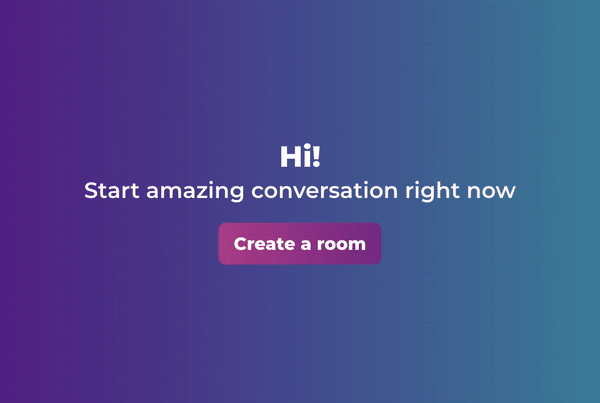
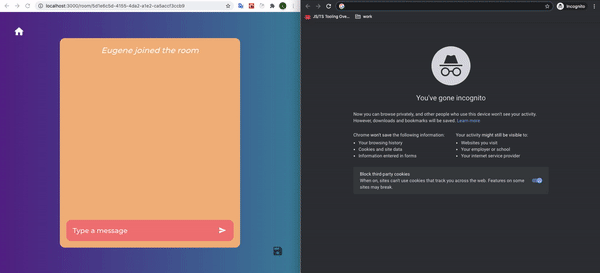

## Сreating a chat

## Join the chat

## Available Scripts

In the project directory, you can run:

### `npm run prepare-env`

Install all dependencies for frontend and backend and run the project 
